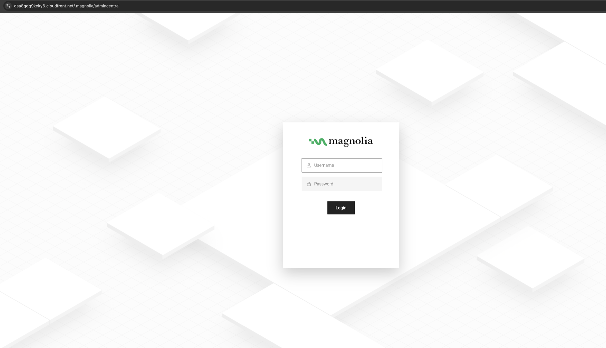
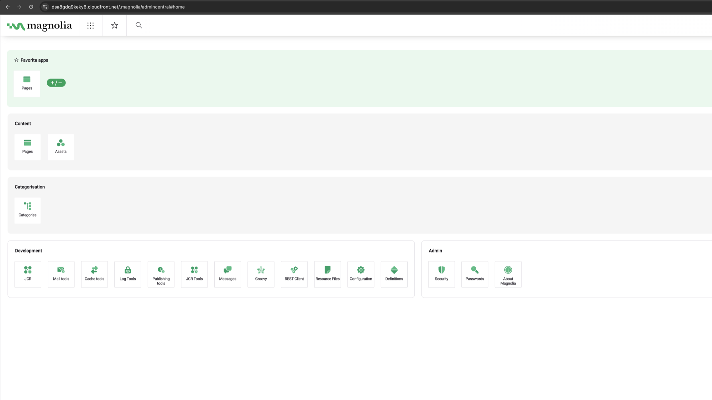

# Crescendo DevOps Exam: Magnolia CMS on AWS

Terraform deploys Magnolia CMS Community Edition 6.4 on AWS: one EC2 instance in a private subnet, behind an Application Load Balancer and CloudFront. Nginx, Tomcat and Magnolia are installed automatically at first boot. GitHub Actions delivers changes: a plan on every PR, and an apply on merge after a manual approval.


<sub>Solid blue: request path. Dashed grey: the instance's outbound traffic. Dotted purple: operator access.</sub>

## Documentation

| Page | What is in it |
|---|---|
| [Architecture](docs/architecture.md) | How a request flows, design decisions, repository layout |
| [Running it](docs/running.md) | Prerequisites, bootstrap, GitHub configuration, deploy, log in, tear down |
| [CI/CD](docs/ci-cd.md) | Pipeline diagram, jobs, security model |
| [Limitations and next steps](docs/limitations.md) | Assumptions, known limitations, how I would keep moving forward, cost |
| [Screenshots](docs/screenshots.md) | Magnolia served through the CloudFront URL |

## Scope

Everything the exam asks for is here. Three things go beyond the brief, and each closes a real gap:

- **Apply on merge, behind a manual approval**, so nobody needs admin keys on a laptop.
- **Unattended Magnolia setup.** Magnolia 6.4 otherwise lets the first visitor of a public URL set the admin password.
- **The ALB is reachable only through this CloudFront distribution.**

## Quick start

Prerequisites: Terraform ≥ 1.11, and AWS CLI v2 with admin credentials for the bootstrap.

```bash
# 1. Once per account: state bucket, GitHub OIDC provider, CI roles
cd bootstrap && terraform init && terraform apply

# 2. Copy the outputs into GitHub repository variables:
#    AWS_PLAN_ROLE_ARN, AWS_APPLY_ROLE_ARN, TF_STATE_BUCKET

# 3. Open a PR, review the plan in its comment, merge,
#    then approve the aws-dev deployment
```

No secrets are stored in GitHub: CI authenticates with OIDC. The Magnolia URL is in the run summary. Log in as `superuser`; the password is in SSM Parameter Store.

Full steps, including deploying from a workstation: [Running it](docs/running.md).

## Assumptions and known limitations

- One dev environment, Magnolia author instance only, no custom domain.
- CloudFront → ALB is plain HTTP.
- A single EC2 instance, with the content on its disk (embedded H2).
- No WAF, alarms or log shipping.

The full list, with impact and the next step for each: [Limitations and next steps](docs/limitations.md).

## Magnolia through CloudFront

| Login page | AdminCentral after login |
|---|---|
|  |  |

More: [Screenshots](docs/screenshots.md).
