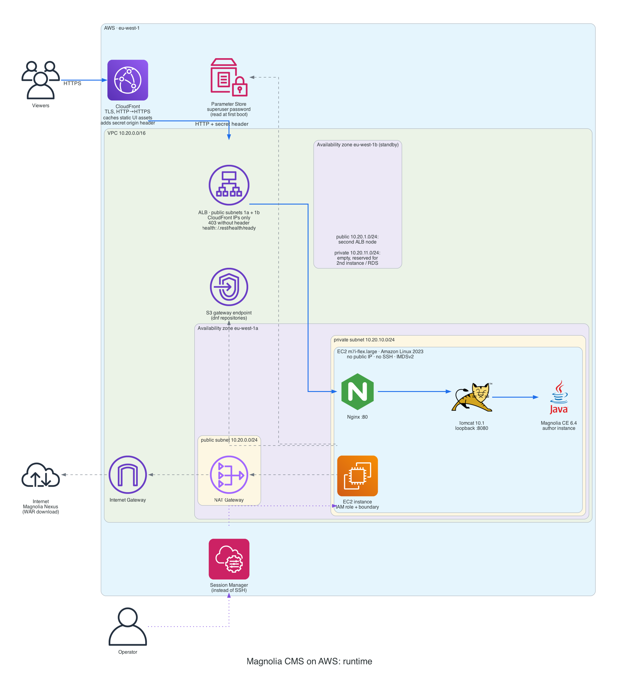

# Architecture

[← README](../README.md)



<sub>Solid blue: request path. Dashed grey: the instance's outbound traffic. Dotted purple: operator access. Both diagrams are generated from code: `pip install diagrams` (needs Graphviz), then `python docs/architecture.py && python docs/cicd.py`.</sub>

## How a request flows

1. **CloudFront** terminates TLS and redirects HTTP to HTTPS. It caches only Magnolia's static UI assets (`/.resources/*`, `/VAADIN/*`), with `?v=<version>` in the cache key. Pages and AdminCentral are never cached. Every origin request gets a secret `X-Origin-Verify` header.
2. **ALB** accepts connections only from CloudFront's IP ranges and answers `403` without the secret header, so it is reachable only through this distribution.
3. **Nginx** proxies to Tomcat and passes on the viewer's scheme, so Magnolia generates `https://` URLs.
4. **Tomcat 10.1** listens on `127.0.0.1` only and runs Magnolia as the root context.
5. **Health check:** the ALB calls Magnolia's readiness probe, `/.rest/health/ready`. A healthy target means the whole chain works, not just Nginx.

## Design decisions

| Decision | Why |
|---|---|
| Four small modules: `network`, `app`, `alb`, `cdn` | Each has one job. Swapping EC2 for an ASG or ECS later only touches `app`. |
| Amazon Linux 2023 packages (`tomcat10`, Corretto 17, `nginx`) | Security fixes arrive through `dnf`. Magnolia 6.4 needs Tomcat 10.1 and Java 17. |
| Magnolia WAR pinned by version and SHA-256 | Provisioning is reproducible and aborts on a changed download. |
| Unattended install; password generated into SSM | No setup form on a public URL. The password never enters Terraform state. |
| No SSH, no bastion; SSM Session Manager | No inbound ports besides ALB → Nginx, and no keys to manage. |
| One NAT gateway; S3 gateway endpoint | One NAT halves the dev cost (`single_nat_gateway = false` gives one per AZ). The free endpoint keeps `dnf` traffic off the NAT. |
| GitHub OIDC with separate plan and apply roles | No AWS keys in GitHub. Plan is read-only; apply needs an approval. See [Security model](ci-cd.md#security-model). |

## Repository layout

```
.
├── bootstrap/                 # one-time per account: state bucket, GitHub OIDC, CI roles, boundary
├── terraform/                 # the Magnolia stack
│   ├── main.tf                # wires the modules together
│   └── modules/
│       ├── network/           # VPC, 2 public + 2 private subnets, IGW, NAT, routes, S3 endpoint
│       ├── app/               # EC2, IAM/SSM, security group, password; templates/user-data.sh.tftpl
│       ├── alb/               # ALB, target group, CloudFront-only access
│       └── cdn/               # CloudFront distribution and cache policy
├── docs/                      # these pages, diagrams as code, screenshots
├── scripts/plan-fingerprint.sh        # hash of planned changes: apply only what was approved
└── .github/workflows/terraform.yml    # PR: fmt → validate → plan · main: plan → approve → apply
```
