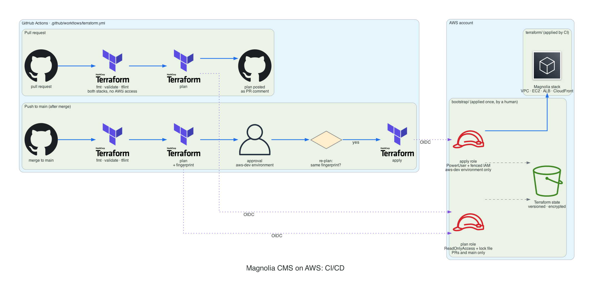

# CI/CD: GitHub Actions

[← README](../README.md)

The workflow is [`.github/workflows/terraform.yml`](../.github/workflows/terraform.yml).

| Job | Runs on | AWS access |
|---|---|---|
| `fmt` | PR, main | none |
| `validate` | PR, main | none; `validate` and `tflint` for both stacks |
| `plan` | PR, main | plan role (read-only); posted as a PR comment |
| `apply` | main, only when the plan has changes | apply role, after approval in the `aws-dev` environment |

## Security model

- **No stored credentials.** GitHub OIDC tokens are exchanged for 1-hour AWS sessions. Each role trusts one exact subject of this repository, and forks get no token.
- **The plan role is read-only.** Anyone who can open a PR from this repository, collaborators included, can run code with it, so it must not be able to change anything. Its one write is the state lock file. It can still read the whole account, including the Terraform state and SSM parameters (see [Known limitations](limitations.md#known-limitations)).
- **The apply role is `PowerUserAccess` plus fenced IAM.** It runs only in the `aws-dev` environment, after approval. It can manage only `magnolia-*` roles, and only with a permissions boundary attached, so it cannot create an admin role or edit the CI roles.
- **Apply runs exactly what was approved.** The apply job re-plans and stops if the hash of the plan ([`scripts/plan-fingerprint.sh`](../scripts/plan-fingerprint.sh)) differs from the approved one.
- **Pinned supply chain.** Actions are pinned to commit SHAs and providers to lock-file hashes. Dependabot proposes updates.
