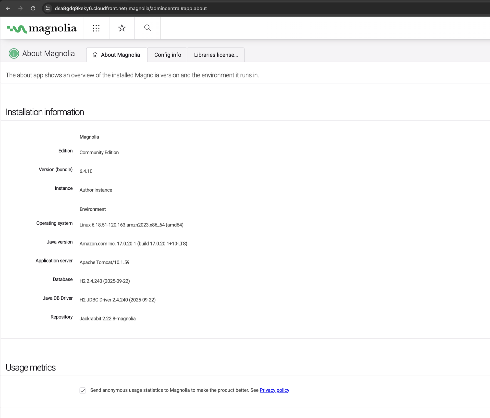
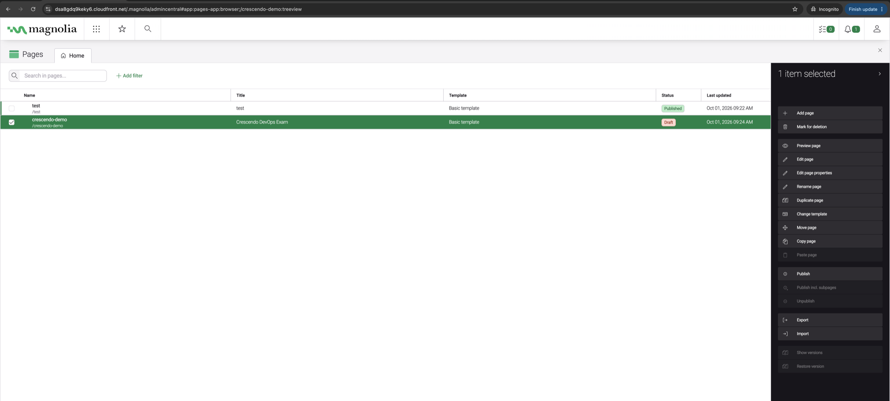
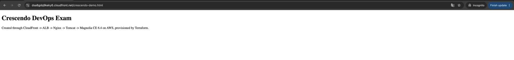

# Screenshots

[← README](../README.md)

All screenshots are taken through the CloudFront URL (`https://dsa8gdq9keky6.cloudfront.net`).

**Login page**, served through CloudFront → ALB → Nginx → Tomcat:

**AdminCentral** after login:

**About Magnolia**: CE 6.4.10, author instance, Amazon Linux 2023, Corretto 17, Tomcat 10.1:

**Pages app** with a page created through the UI:

**The page rendered by Magnolia:**

